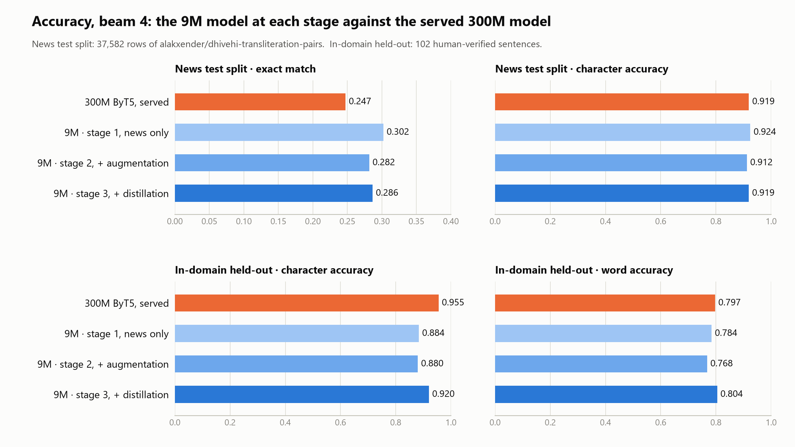
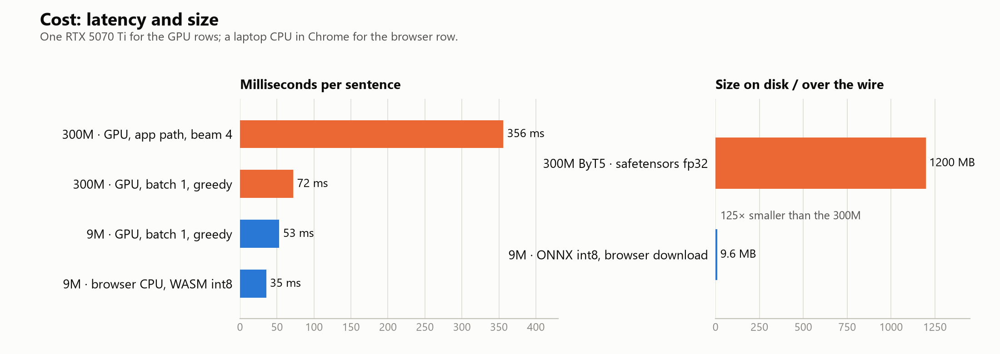
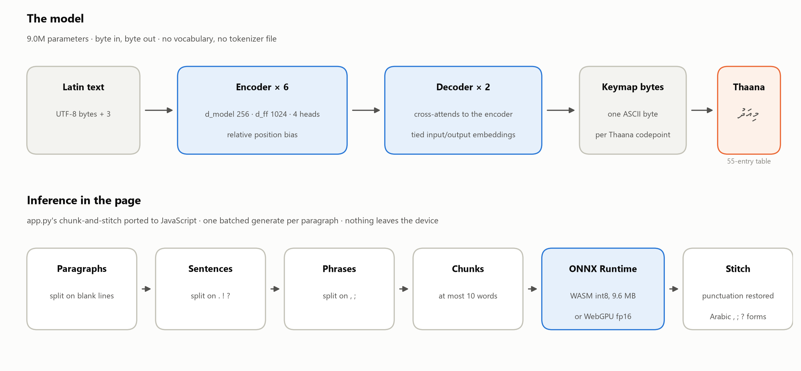
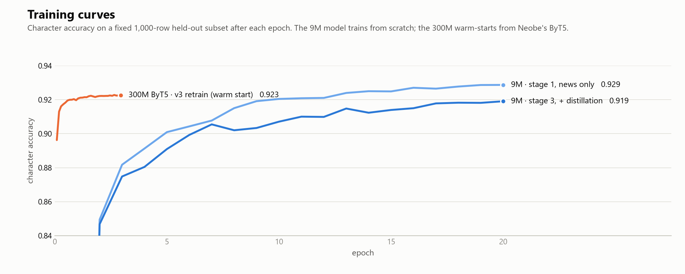

# dhivehi-tiny-latin2thaana-keymap-v1

**📄 Paper: [Shaped by the Script: Designing the Representation Around the Writing System for Efficient Low-Resource Transliteration](paper/small-enough-for-the-browser.pdf)**

A **9M-parameter** byte-level encoder–decoder for **Latin-script Dhivehi → Thaana**
transliteration, trained from scratch and shipped as ONNX for the browser.
It runs entirely on the device: **35 ms per sentence on a laptop CPU** in
WebAssembly, from a **9.6 MB** download, with no server and no text leaving the page.

On the public news test split it **matches the 300M ByT5 fine-tune it was
distilled from** on character accuracy (0.919 vs 0.919) and beats it on exact
match (0.286 vs 0.247), and it passes the same one-word checks. On a held-out
set of Dhivehi Latin chat text it leads on word accuracy (0.804 vs 0.797) and
trails on character accuracy (0.920 vs 0.955).

Code, demo page and evaluation harness: https://github.com/streetsolider/div-transliteration-web

## Quick start

### Requirements

- Python 3.9+ (only to serve the folder with the right headers; nothing is installed)
- A browser with WebAssembly: any current Chrome, Edge, Firefox or Safari, desktop or phone
- Optional: Node 18+ for the evaluation harness, a WebGPU-capable browser for the fp16 path

### Browser demo

Live at https://streetsolider.github.io/div-transliteration-web/ — or run it yourself:

```bash
git clone https://github.com/streetsolider/div-transliteration-web
cd div-transliteration-web
python serve.py            # port 8788; add a number for another port
```

Visit http://localhost:8788. The page fetches the model from the Hub on first
load (9.6 MB) and the runtime caches it in the browser, so after that the only
thing still coming from elsewhere is Transformers.js itself, from jsDelivr.
Every font is served from this repo. `?model=byt5-tiny-distill` loads the copy
under `models/` instead of the Hub, leaving jsDelivr as the only remote fetch.

`serve.py` is a plain static server that adds `Cache-Control: no-cache` and the
cross-origin isolation headers (COOP/COEP). Without those headers the runtime
falls back to single-threaded WASM, about twice as slow per sentence, so any
other static server works but is slower. To try it from a phone, open
`http://<your-LAN-IP>:8788` (the server binds 0.0.0.0).

Query parameters on the page: `?device=webgpu` uses the fp16 model on the GPU,
`?dtype=fp16` picks the fp16 files, `?model=<hub id or folder>` loads another
model.

### Node harness

Scores the model on a TSV of `latin<TAB>keymap` rows through the same chunking
as the page, and times it:

```bash
npm install
node harness.mjs models/byt5-tiny-distill rows.tsv --dtype q8 --n 500
```

`rows.tsv` is a header line `latin\tkeymap` followed by one pair per line, the
target in the Segha keymap (ASCII), not Thaana. No test file ships with the
repo; the news test split is on the Hub at
[`alakxender/dhivehi-transliteration-pairs`](https://huggingface.co/datasets/alakxender/dhivehi-transliteration-pairs).

### Python

The same ONNX files load in Python with optimum (the file names are not
optimum's defaults, so they are passed explicitly); the tokenizer is the stock
ByT5 one from any ByT5 checkpoint:

```bash
pip install "optimum[onnxruntime]" transformers
```

```python
from optimum.onnxruntime import ORTModelForSeq2SeqLM
from transformers import AutoTokenizer
import json

model = ORTModelForSeq2SeqLM.from_pretrained(
    "str33t/dhivehi-tiny-latin2thaana-keymap-v1", subfolder="onnx",
    encoder_file_name="encoder_model_quantized.onnx",
    decoder_file_name="decoder_model_merged_quantized.onnx",
    use_merged=True, use_cache=False)   # the merged decoder carries its own cache
tok = AutoTokenizer.from_pretrained("google/byt5-small")
keymap = json.load(open("keymap.json", encoding="utf-8"))

ids = tok(["miadhu male ah dhaan jehey"], return_tensors="pt")
out = tok.batch_decode(model.generate(**ids, max_new_tokens=128, num_beams=4), skip_special_tokens=True)
print("".join(keymap.get(c, c) for c in out[0]))   # މިއަދު މާލެއަށް ދާންޖެހޭ
```

## Results (beam 4)

| System | params | news test: exact / char acc | chat test: char / word acc | one-word inputs | per sentence |
|---|---|---|---|---|---|
| **this model** (stage 3, distilled) | **9M** | **0.286 / 0.919** | 0.920 / **0.804** | 4/4 | **35 ms, browser CPU** |
| this architecture, stage 1 (news only) | 9M | **0.302 / 0.925** | 0.884 / 0.784 | 1/4 | 40 ms, browser CPU |
| this architecture, stage 2 (+augmentation) | 9M | 0.282 / 0.912 | 0.880 / 0.768 | 4/4 | 43 ms, browser CPU |
| [str33t/dhivehi-byt5-latin2thaana-keymap-v1](https://huggingface.co/str33t/dhivehi-byt5-latin2thaana-keymap-v1) (300M, served) | 300M | 0.247 / 0.919 | **0.955** / 0.797 | 4/4 | 356 ms, GPU |

News test split: the 37,582-row test split of `alakxender/dhivehi-transliteration-pairs`.
Chat test: 102 human-verified sentences from the Dhivehi Latin chat text corpus
described under Training. One-word inputs: the four short inputs the 300M
fine-tune exists to fix (`bohkuraa`, `kuru`, `karu`, `bas`).





Exact match has a low ceiling on this test split: many reference rows are a
different headline from their source rather than a transliteration of it, so
character accuracy is the number to trust.

## Why a 9M model

The served model is a fine-tune of a 300M ByT5-small: 1.2 GB of weights, a
GPU, a server round trip. Transliteration is a character-level mapping with
short inputs, and the grapheme-to-phoneme literature had already shown a ByT5
with d_model 256 serving a hundred languages in 7–20M parameters. The bet was
that a model that small, trained from scratch on the task alone, would match a
general model fine-tuned for it, and be fast enough for a phone. It did, with
one honest caveat: on Dhivehi Latin chat text it needed the 300M model as a
teacher to get there.

## Architecture



- T5 architecture, ByT5-style byte tokenizer: input id = UTF-8 byte + 3, no vocabulary file.
- 6 encoder + 2 decoder layers, d_model 256, d_ff 1024, 4 heads, tied embeddings: **9.0M parameters**.
- Output is the **Segha phonetic keymap**, one ASCII byte per Thaana codepoint, converted
  to Thaana by a 55-entry table after decoding. Thaana codepoints are three UTF-8 bytes
  each, so emitting the keymap costs a third of the decoder steps. The table is in
  `keymap.json`; the layout is [`jawish/jtk`](https://github.com/jawish/jtk)'s phonetic map.
- Exported with optimum to ONNX: encoder 6.6 MB and decoder 3.0 MB at int8 for WASM,
  fp16 variants for WebGPU. The merged decoder keeps its matrix multiplies inside
  If-subgraphs, which the dynamic quantizer skips, so the two decoder halves are quantized
  first and merged afterwards.

## Training

Three stages, each checked on the news test split, the chat test set and the
four one-word inputs before the next was allowed:

1. **News only.** 150,326 pairs from `alakxender/dhivehi-transliteration-pairs`, from scratch:
   lr 1e-3, 5% warmup, linear decay, batch 64, 20 epochs, bf16, 49 minutes on one RTX 5070 Ti.
   Already ahead of the 300M model on the news split, but one- to three-word inputs
   duplicate the word (`bas` → `basq, basq`): the corpus has no short rows.
2. **Augmentation.** The same length-diverse augmentations the 300M fine-tune uses
   (single words, short phrases, long concatenations, place names with chat
   misspellings, English loanwords), 173,353 pairs. Fixes the short inputs, costs a
   little on the news split.
3. **Distillation.** 73,265 sentence pairs produced by the 300M model over a Dhivehi Latin
   chat text corpus (Dhivehi typed in Latin letters in messages; not redistributed), with
   its known systematic errors corrected, added to the stage 2 corpus: 246,618 pairs,
   20 epochs, 1 h 53 min. This is what closes the chat-text gap.
   A warm-started variant, continuing from stage 2, scored about a point lower than
   training from scratch on the full corpus.



Before release the model was probed for memorisation of that corpus: free-running
generations from short prompts, and continuations from two-word prefixes of corpus
sentences, were checked against every word 4-gram and character 15-gram unique to it.
No corpus text was emitted and no continuation matched.

## Usage

In the browser or Node with [Transformers.js](https://github.com/huggingface/transformers.js)
3.x. There is no `tokenizer.json`: ByT5 tokenization is bytes + 3, done in a few lines.

```js
import { env, Tensor, AutoModelForSeq2SeqLM } from '@huggingface/transformers';

const model = await AutoModelForSeq2SeqLM.from_pretrained('str33t/dhivehi-tiny-latin2thaana-keymap-v1', { dtype: 'q8' });
const keymap = await (await fetch('keymap.json')).json();   // ASCII -> Thaana table, in this repo

const enc = new TextEncoder(), dec = new TextDecoder();
function encode(texts) {                                    // ByT5: id = byte + 3, eos = 1, pad = 0
  const rows = texts.map((t) => [...Array.from(enc.encode(t)).map((b) => b + 3), 1]);
  const L = Math.max(...rows.map((r) => r.length));
  const ids = new BigInt64Array(rows.length * L), mask = new BigInt64Array(rows.length * L);
  rows.forEach((r, i) => r.forEach((v, j) => { ids[i * L + j] = BigInt(v); mask[i * L + j] = 1n; }));
  return { input_ids: new Tensor('int64', ids, [rows.length, L]), attention_mask: new Tensor('int64', mask, [rows.length, L]) };
}
function decode(out) {                                      // bytes back to text, stop at eos
  const [n, L] = out.dims, res = [];
  for (let i = 0; i < n; i++) { const b = []; for (let j = 0; j < L; j++) { const v = Number(out.data[i * L + j]); if (v === 1) break; if (v >= 3) b.push(v - 3); } res.push(dec.decode(Uint8Array.from(b))); }
  return res;
}

const out = await model.generate({ ...encode(['miadhu male ah dhaan jehey']), max_new_tokens: 128 });
const thaana = decode(out)[0].split('').map((c) => keymap[c] ?? c).join('');
console.log(thaana);   // މިއަދު މާލެއަށް ދާންޖެހޭ
```

For inputs longer than about ten words, split as the demo page does (paragraphs →
sentences → phrases → 10-word chunks, one batched `generate` per paragraph, then
stitch); `pipeline.js` is that logic and `index.html` is a working page. See
[Quick start](#quick-start) for running the page, the Node harness and the
Python loader.

## Intended use and limitations

Latin-script Dhivehi as people type it in messages and search boxes, to Thaana. Trained
on news and on a Dhivehi Latin chat text corpus; evaluated on both. Expect weaker
output on rare proper names and on registers far from either. Single training seed.
The decoder has no length limit of its own; the demo caps generation at 2.5× the
input bytes to stop the rare runaway on an unseen name.

## License

MIT, for the code and the model files alike. See `LICENSE`.

The bundled fonts keep their own terms: IBM Plex is under the SIL Open Font
License 1.1 (`fonts/IBM-Plex-OFL.txt`). Faruma and Mv MAG Round XBold are
long-standing free Thaana fonts redistributed without a licence file of their
own; they are listed as free for personal and commercial use, but that is not
a licence this repo can vouch for.
